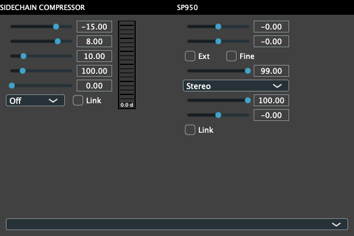

# NINE50

A French-touch sidechain processor with SP950-style lo-fi emulation, inspired by Daft Punk's *Homework* era. Combines an Alesis 3630-style sidechain compressor with Emu SP-1200/Akai S950 emulation in a single VST3/AU plugin.



## Features

### Sidechain Compressor
- VCA-style feed-forward compressor with aggressive ratios (up to 10:1)
- Optional sidechain input bus for external key signals
- High-pass filter on sidechain (100/200/300 Hz)
- Makeup gain compensation
- Channel linking for stereo sidechain detection

### SP950 Emulation
- 12-bit bit reduction with TPDF dither
- Sample rate reduction to 26.04 kHz (SP-1200 characteristic)
- Detune/pitch shift with semitone or fine (0.1 st) steps
- 6th-order Butterworth low-pass filter (bypassable)
- Multiple channel layouts: Mono Sum, Mono L/R, Stereo, Stereo L/R, Mid/Side
- Drive and output gain with link option
- Dry/wet mix control

## Requirements

- **macOS**: 10.15 or later
- **Windows**: Windows 10 or later
- **Linux**: Not supported (plugin formats require platform-specific SDKs)

## Installation

### Download (Recommended)

Download the latest release from the [Releases page](https://github.com/audiohacking/nine50/releases).

**macOS**:
1. Download `NINE50-macOS.zip`
2. Extract the archive
3. Double-click `NINE50.vst3` or `NINE50.component` to install
4. Restart your DAW

**Windows**:
1. Download `NINE50-Windows.zip`
2. Extract the archive
3. Copy `NINE50.vst3` to `C:\Program Files\Common Files\VST3\`
4. Restart your DAW

### Build from Source

#### Prerequisites

- CMake 3.16+
- C++17 compatible compiler (Xcode 12+, Visual Studio 2019+, or GCC 9+)
- On macOS: Xcode Command Line Tools

#### Build Instructions

```bash
# Clone the repository
git clone https://github.com/audiohacking/nine50.git
cd NINE50

# Configure (VST3 + AU on macOS, VST3 on Windows)
cmake -B build -DCMAKE_BUILD_TYPE=Release

# Build
cmake --build build -j8

# The plugin will be in build/Source/NINE50_artefacts/
```

#### Build with Tests

```bash
cmake -B build -DBUILD_TESTING=ON
cmake --build build -j8
ctest --test-dir build
```

See [DEVELOP.md](DEVELOP.md) for detailed development guidelines.

## Usage

1. Add NINE50 to a bus/aux track in your DAW
2. Route a sidechain signal (e.g., kick drum) to the sidechain input
3. Adjust the Threshold and Ratio to control ducking depth
4. Use the SP950 section to add lo-fi character to the wet signal
5. Fine-tune with Attack, Release, and Makeup controls

## License

[GNU Affero General Public License v3.0](LICENSE)

## Credits

- Inspired by the French-touch house production techniques of Daft Punk, Cassius, and others
- SP-1200 and S950 emulation based on classic sampler characteristics
- Compressor design inspired by the Alesis 3630
