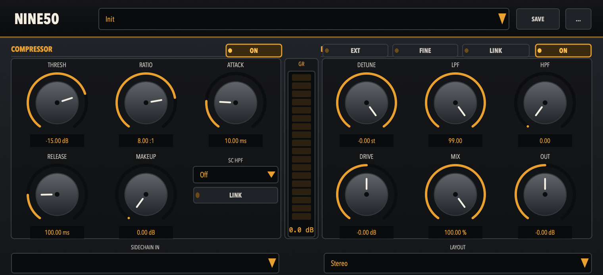

# NINE50

A French-touch sidechain processor inspired by Daft Punk's *Homework* era. Combines an Alesis 3630-style sidechain compressor with Emu SP-1200 / Akai S950 bitcrush and downsample emulation in a single plugin.



## Features

- Analog-inspired UI with labeled rotaries, amber GR metering, and per-stage ON/BYPASS
- Factory presets plus user save/load (`.nine50` files in `~/Library/Audio/Presets/NINE50`)

### Sidechain Compressor
- VCA-style feed-forward compressor with aggressive ratios (up to 10:1)
- Optional stereo sidechain input bus for external key signals
- High-pass filter on the sidechain key (100/200/300 Hz)
- Makeup gain and stereo link

### Bitcrush / Downsample (SP-1200 / S950)
- Single **DETUNE** control: mild SP character (26.04 kHz / 12-bit) through heavy crush (~900 Hz / 5-bit; EXT → ~400 Hz / 4-bit) — pitch and duration stay constant
- Open input anti-alias, nearest-neighbour ADC, hard midtread quantize, and ZOH reconstruction (Yeh / [pitcher](https://github.com/mwcm/pitcher)–inspired)
- **LPF** (S950-style 6th-order, 0–99, bypass at 99) and **HPF** (0–99, off at 0)
- Drive, mix, and out (with optional drive/out link)
- Layouts: Mono Sum/L/R, Stereo, Stereo L/R/Mid/Side (wet/dry after layout)

## Requirements

- **macOS**: 10.15 or later (VST3 + AU)
- **Windows**: 10 or later (VST3)
- **Linux**: modern x86_64 distro with ALSA (VST3)

## Installation

### Download (Recommended)

Download the latest release from the [Releases page](https://github.com/audiohacking/nine50/releases).

**macOS**:
1. Download `NINE50-macOS.zip` (or the `.pkg` installer)
2. Extract the archive
3. Double-click `NINE50.vst3` or `NINE50.component` to install (or run the installer)
4. Restart your DAW

**Windows**:
1. Download `NINE50-Windows.zip`
2. Extract and copy `NINE50.vst3` into your VST3 folder (typically `C:\Program Files\Common Files\VST3`)
3. Rescan plugins in your DAW

**Linux**:
1. Download `NINE50-Linux.zip`
2. Extract and copy `NINE50.vst3` into a VST3 path (e.g. `~/.vst3` or `/usr/lib/vst3`)
3. Rescan plugins in your DAW

### Build from Source

#### Prerequisites

- C++17 compatible compiler (Xcode 12+, MSVC 2019+, or GCC/Clang on Linux)
- CMake 3.16+
- Linux: see [JUCE Linux Dependencies](https://github.com/juce-framework/JUCE/blob/master/docs/Linux%20Dependencies.md) (ALSA, X11, FreeType, etc.)

#### Build Instructions

```bash
# Clone the repository
git clone https://github.com/audiohacking/nine50.git
cd nine50

# Configure (VST3 everywhere; AU on macOS)
cmake -B build -DCMAKE_BUILD_TYPE=Release

# Build
cmake --build build -j8 --config Release

# Artefacts: build/Source/NINE50_artefacts/Release/
```

#### Build with Tests

```bash
cmake -B build -DBUILD_TESTING=ON
cmake --build build -j8
ctest --test-dir build
```

See [DEVELOP.md](DEVELOP.md) for detailed development guidelines.

## Usage

1. Add NINE50 to a bus/aux track in your DAW
2. Route a sidechain signal (e.g. kick) to the sidechain input
3. Set Threshold / Ratio for ducking; use Attack, Release, and Makeup to shape the pump
4. In BITCRUSH, sweep **Detune** for SP grit, then shape with **LPF** / **HPF**, Drive, Mix, and Out
5. Bypass either stage with the ON/BYPASS switches

## License

[GNU Affero General Public License v3.0](LICENSE)

## Credits

- Inspired by the French-touch house production techniques of Daft Punk, Cassius, and others
- SP-1200 and S950 emulation based on classic sampler characteristics
- Downsample / ADC techniques informed by Yeh’s SP-12 circuit model and [pitcher](https://github.com/mwcm/pitcher)
- Compressor design inspired by the Alesis 3630
